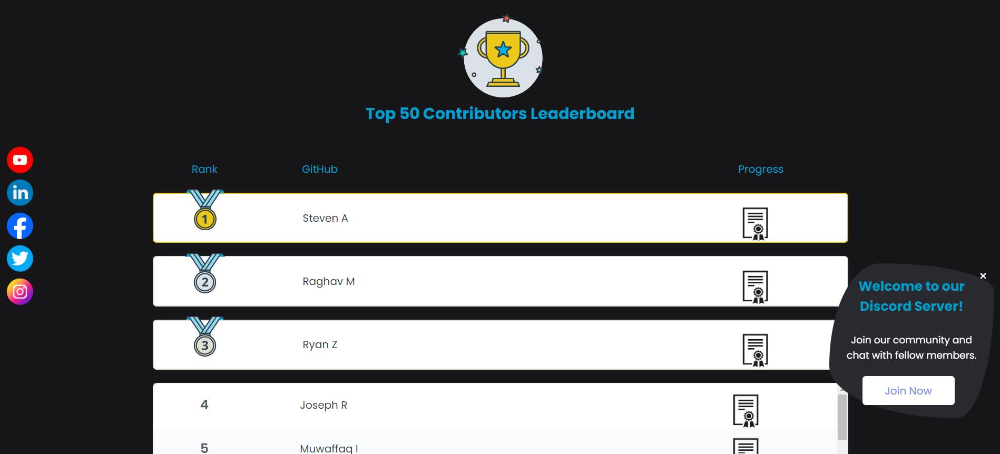

# Chrome Gaming Community Page


## About Our Project 💻
<div align="center">


  <br>

   

  
  
   
  
  
  
  
  
  </div>

## Chrome Gaming Community Page

Welcome to the Chrome Gaming Community Page! This online space within the Chrome browser is where gamers come together to connect, discuss games, share content, get updates, troubleshoot issues, join events, and interact with developers. Consider this your one-stop hub for all things gaming-related in the Chrome ecosystem.
#### Homepage


#### Leaderboard


### What You'll Find Here:

- **Discussion Forums:** Engage with fellow gamers in lively discussions about your favorite games, upcoming releases, gaming hardware, and more.

- **Content Sharing:** Share your gaming experiences, screenshots, videos, and tips with the community. Whether you've discovered a hidden gem or want to showcase your latest achievements, this is the place to do it.

- **Updates & Announcements:** Stay informed about the latest news, updates, patches, and releases in the world of Chrome gaming. Be the first to know about new features, events, and promotions.

- **Troubleshooting Assistance:** Encountering technical issues? Our community is here to help. Get support from fellow gamers and troubleshoot common problems together.

- **Events & Tournaments:** Join exciting gaming events, tournaments, and challenges hosted within the Chrome gaming community. Compete against other players, earn rewards, and showcase your skills.

- **Developer Interaction:** Connect directly with game developers, provide feedback, suggest improvements, and participate in Q&A sessions. Help shape the future of gaming on Chrome.

## Project Website

Check out the [project website](https://gamesphere-multiplayer.github.io/Community-Page/) for more information.

### How to Get Involved:

1. **Sign Up:** Joining the Chrome Gaming Community is easy. Simply create an account to start participating in discussions, sharing content, and accessing exclusive features.

2. **Explore:** Take some time to explore the various sections of the community page. Find discussions that interest you, discover new games, and connect with like-minded gamers.

3. **Contribute:** Share your knowledge, experiences, and insights with the community. Whether you're a seasoned gamer or just starting out, your contributions are valuable.

4. **Stay Updated:** Don't miss out on important announcements, events, and updates. Keep an eye on the community page, and subscribe to notifications to stay in the loop.

5. **Be Respectful:** Remember to treat your fellow gamers with respect and courtesy. This is a diverse community with members from all walks of life. Let's foster a positive and inclusive environment for everyone.

### How to Make a PR in a Project 🟢

If you are interested in contributing to this project, here's how you can get started:

1. **Fork the Repo:** Fork the repository to your GitHub account.

2. **Clone the Repo:** Clone the forked repository to your local machine using the following command:
    
    ```bash
    git clone https://github.com/<your-github-username>/Community-Page
    ```

3. **Add a Remote Upstream:** Add a remote upstream to the original repository with the following command:
    
    ```bash
    git remote add upstream https://github.com/Durgesh4993/Community-Page/
    ```

4. **Create a New Branch:** Create a new branch for your changes with the following command:
    
    ```bash
    git checkout -b <your-branch-name>
    ```

5. **Make Changes:** Make changes to the source code.

6. **Add Your Changes:** Add your changes using the following command:
    
    ```bash
    git add <File1 changed> <File2 changed> ...
    ```

7. **Commit Your Changes:** Commit your changes with a descriptive message:
    
    ```bash
    git commit -m "<your-commit-message>"
    ```

8. **Push Your Changes:** Push your changes to your forked repository:
    
    ```bash
    git push origin <your-branch-name>
    ```

9. **Create a PR:** Create a pull request from your forked repository to the original repository.

Alternatively, you can use GitHub Desktop for a more streamlined process:

1. Open GitHub Desktop and log in to your GitHub account.

2. Add your repository to GitHub Desktop.

3. Ensure you are on the correct branch for your changes.

4. Make your changes and commit them using GitHub Desktop.

5. Push your changes to your forked repository using GitHub Desktop.

6. Create a pull request from your forked repository on the GitHub website.

**Note:** Make sure you have a fork of the original repository in your GitHub account and that you make your changes in that forked repository before creating a pull request.

## License

This project is licensed under the Apache License, Version 2.0 - see the [LICENSE](LICENSE) file for details.


## Contact Us:

Have questions, feedback, or suggestions? Contact our community moderators or administrators for assistance.

Thank you for being a part of the Chrome Gaming Community. Let's make this a vibrant and thriving space for gamers everywhere!
